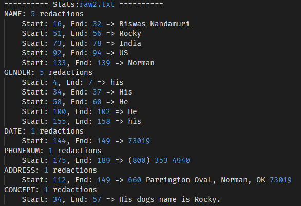

# Documentation
This file includes explanation about the entity finding algorithms and how the algorithms are implemented in python using SpaCy Matcher, Pyap and SpaCy-Wordnet.

## Overview
> See [Run on local system](../README.md) to run this project locally.

This tool redacts sensitive data (like names, genders, dates, phones, addresses and concepts) based on given command line arguments. The redacted files are stored in folder indicated by `--output` with the extensions `.redacted`. 

The tool also generates statistics for the redaction process and stores them in a file or writes it to special files like `stdout` or `stderr` based on the `--stats` flag. 

The stats are formatted as follows:

## Redaction Pipeline
The redaction pipeline is responsible for redacting the content of each file based on given flags, along with returning the redacted text and the statistics of how many number of entities were redacted. This pipeline collects all the entities in the form of `list[spacy.tokens.Span]` and redacts them at the end.

The main redaction pipeline is located in [project1 init file](../project1/__init__.py).

## Entity Finders
The entity finders are responsible to identity the entities or sentences based on concepts provided. Entity finders are located in [entity_finders.py](../project1/entity_finders.py).

The following finders are available in this module:
- [Names Finder](#names-finder)
- [Genders Finder](#genders-finder)
- [Dates Finder](#dates-finder)
- [Phone numbers Finder](#phone-numbers-finder)
- [Addresses Finder](#addresses-finder)
- [Concepts Finder](#concepts-finder)

### Names Finder
> function signature: `names_finder(doc: Doc, nlp: Language) -> list[Span]`

This function is used to identity any names present in the given unredacted document content. `names_finder` uses SpaCy's Matcher and SpaCy's NER (Named Entity Recognizer) pipe to identity the names. Identified names are stored as SpaCy's Span list and returned.

Below are the patterns used to recognize names using SpaCy's Matcher:
| Pattern  | Example | Comment |
|----------|-------------|-------------|
|`{"ORTH": {"IN": ["Dr.", "Mr.", ...]}}, {"IS_SPACE": True, "OP": "?"},{"ENT_TYPE": "PERSON", "OP": "+"}`|"Dr. Christan Grant", "Ms Jasmine M. DeHart"|And `PERSON` entity with preceding titles `(Dr., Ms., Mr., Miss.)`|
|`{"ENT_TYPE": "PERSON", "OP": "+"}, {"ORTH": ","},{"ENT_TYPE": "PERSON", "OP": "+"}`|"Nandamuri, Biswas", "Grant, Christan E."|Any two `PERSON` entity tokens seperated by comma|
|`{"ENT_TYPE": {"IN": ["PERSON", "ORG"]}}, {"ORTH": "'s"}`|"NATO's", "Jackson's"|Any token recognized as `PERSON` or `ORG` followed by `'s`|
|`{"ENT_TYPE": {"IN": ["PERSON", "GPE"]}, "OP": "+"}`|"Biswas Nandamuri", "Christan Grant"|Any continous number of tokens recognized as `PERSON` or `GPE`|
|`{"ENT_TYPE": {"IN": ["NORP", "ORG"]}, "OP": "+"}`|"Russian", "American", "Indian"|Any continous number of tokens recognized as `NORP` or `ORG`|

### Genders Finder
> function signature: `genders_finder(doc: Doc, nlp: Language) -> list[Span]`

This function is used to identity any words which reveal the gender of a subject. `genders_finder` contains a list of such gender-revealing words and uses SpaCy matcher to identity those word in lemmatized form. Identified gender-words are stored as SpaCy's Span list and returned.

Below is the pattern used to recognize genders using SpaCy's Matcher:
| Pattern  | Example | Comment |
|----------|-------------|-------------|
|`{"LOWER": {"IN": ["he", "him", "dad", "gentleman", ....]}}`|"He", "he", "Father"|Any token whose lemmatized form is in the `gender_lemmas` list|

### Dates Finder
> function signature: `dates_finder(doc: Doc, nlp: Language) -> list[Span]`

`dates_finder` is used to identity any type of dates or time-revealing words (a century ago) using SpaCy's Matcher and NER. Identified dates or time-revealing tokens are stored as SpaCy's Span list and returned.

Below are the patterns used to recognize dates using SpaCy's Matcher:
| Pattern  | Example | Comment |
|----------|-------------|-------------|
|`{"ENT_TYPE": "DATE", "OP": "+"}`|"Feb 3rd, 2022", "3rd February"|Any token or tokens recognized as `DATE` entity by SpaCy NER|
|`{"TEXT": {"REGEX": "[0-9]{1,2}/[0-9]{1,2}/[0-9]{4}"}}`|"3/2/2001", "03/02/2001"|Any date representing two digit day and month along with four digit year. Seperated by `/`|
|`{"TEXT": {"REGEX": "[0-9]{1,2}/[0-9]{1,2}/[0-9]{2}"}}`|"3/2/01", "03/02/01"|Any date representing two digit day and month along with two digit year. Seperated by `/`|

### Phone numbers Finder
> function signature: `phones_finder(doc: Doc, nlp: Language) -> list[Span]`

`phones_finder` is used to identity any type of 10-digit phone numbers (preceded with `+1` or not) using SpaCy's Matcher. The reqular expression is used is from the [following book](https://www.oreilly.com/library/view/regular-expressions-cookbook/9781449327453/ch04s02.html). All identified phone numbers are stored as SpaCy's Span list and returned.

Below are the patterns used to recognize dates using SpaCy's Matcher:
| Pattern  | Example | Comment |
|----------|-------------|-------------|
|`{"ORTH": "+1", "OP": "?"},{"ORTH": "(", "OP": "?"},{"TEXT": {"REGEX": "[2-9][0-8][0-9]"}},{"ORTH": ")", "OP": "?"},{"TEXT": {"REGEX": r"[-.● ]"}, "OP": "?"},{"TEXT": {"REGEX": "[2-9][0-9]{2}"}},{"TEXT": {"REGEX": r"[-.● ]"}, "OP": "?"},{"TEXT": {"REGEX": "[0-9]{4}"}}`|"(800) 353 4940", "+1 800 353 4940"|Any phone number following the RegEx `^\(+1)?\(?([2-9][0-8][0-9])\)?[-.● ]?([2-9][0-9]{2})[-.● ]?([0-9]{4})$`|
|`{"TEXT": {"REGEX": "[2-9][0-8][0-9][2-9][0-9]{2}[0-9]{4}"}}`|"8003534940"|Any 10-digit number starting with area-code between 200 to 989|

### Addresses Finder
> function signature: `address_finder(doc: Doc, nlp: Language) -> list[Span]`

`address_finder` uses `pyap` to identity any addresses in the given document. `pyap` returns the found addresses in the form of `pyap.address.Address` object. This tool converts that `Address` data into list and identifies the starting and ending of each address found. Later these starting and ending values of addresses are converted into a regular expressions pattern used by SpaCy's Matcher. All identified addresses are stored as SpaCy's Span list and returned.

#### Example:
Using address `660 Parrington Oval, Norman, OK 73019`, the pattern generated would look like `[{"ORTH": "660"}, {"ORTH": "Parrington"}, {"ORTH": "Oval"}, {"TEXT": {"REGEX": r".*"}, "OP": "*"}, {"ORTH": "OK"}, {"ORTH": "73019"}]`

### Concepts Finder
> function signature: `concept_finder(doc: Doc, nlp: Language, concepts: list[str]) -> list[Span]`

`concept_finder` need an Language pipeline which has `spacy_wordnet` custom annotations added using `nlp.add_pipe("spacy_wordnet",after='tagger',config={'lang': nlp.lang})`. This custom annotation enable this tool to retrieve `Synonyms`, `Hyponyms`, `Member Holonyms` and `Part Holonyms` of the given concept words and store them in an array called `concept_words`. Later any sentences containing words from this `concept_words` list are stored as SpaCy's Span list and returned.

