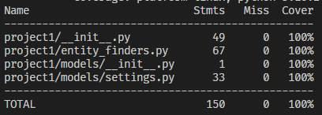

# Testing
This file explans about the unittesting done to this utility using `pytest`. The test coverage for this utility is at `92%`.

Testing is done specific to the three parts of this utility.
- [Entity Finders](#entity-finders)
- [Settings Model](#settings-model)
- [Project Level](#project-level)

## Entity Finders
Tests in folder [`test_entity_finders`](../tests/test_entity_finders/) are used to test the entity finders. In each file except `test_concept_finder.py`, there is a pytest fixture which creates english language pipeline using SpaCy. This NLP pipeline is created once and used for all the parameterized tests. This is done using `@pytest.fixture(scope='module')`.

### Names Finder
[`test_names_finder.py`](../tests/test_entity_finders/test_names_finder.py) contains the testcases for identitfying names in various formats. This file includes a `parameterized` test which checks if the returned names are equal to the expected names list. This is done using `frozenset` and `all()`.

### Genders Finder
[`test_genders_finder.py`](../tests/test_entity_finders/test_genders_finder.py) contains the testcases for identitfying gender-revealing words in the given text. Similar to names finder tests this file includes a `parameterized` test which checks if the returned genders are equal to the expected genders list. This is done using `frozenset`.

### Dates Finder
[`test_dates_finder.py`](../tests/test_entity_finders/test_dates_finder.py) contains the testcases for identitfying dates and time-revealing words (like a century ago) in the given text. A `parameterized` test function along with `frozenset` are used to test `dates_finder` function.

### Phones Finder
[`test_phones_finder.py`](../tests/test_entity_finders/test_phones_finder.py) tests `phones_finder` function. This test also uses `parameterized` test function to find phone numbers like `(800) 353 4940` or `8003534940`.

### Addresses Finder
[`test_address_finder.py`](../tests/test_entity_finders/test_address_finder.py) contains the testcases for identitfying physical addresses in the given text. Similar to names finder test this file includes a `parameterized` test which checks if the returned names are equal to the expected names list. This is done using `frozenset`.

### Concepts Finder
[`test_concept_finder.py`](../tests/test_entity_finders/test_concept_finder.py) contains the testcases for identitfying sentences similar to the given concept in the given text. To find the similar words SpaCy uses Nltk's WordNet support. This is done by adding `spacy_wordnet` component to the NLP pipeline in the pytest fixture. Using this fixture the `concept_finder` identifies the concept relates sentences and returns them to the test function.

## Settings Model
The [`settings.py`](../project1/models/settings.py) contains a `Settings` class which parses the command line arguments passes by the user to start the redaction process. [`test_models.py`](../tests/test_models.py) contains tests cases for every usecase of the settings class. This test file consists of `parameterized` tests which checks for every possible valid and invalid arguments passed by the user.

## Project Level
[`test_project1`](../tests/test_project1.py) contains a single test for the entire redaction process. This file tests `redact_pipeline` in [`project1/__init__.py`](../project1/__init__.py) to see if the expected redacted text and expected stats are returned.